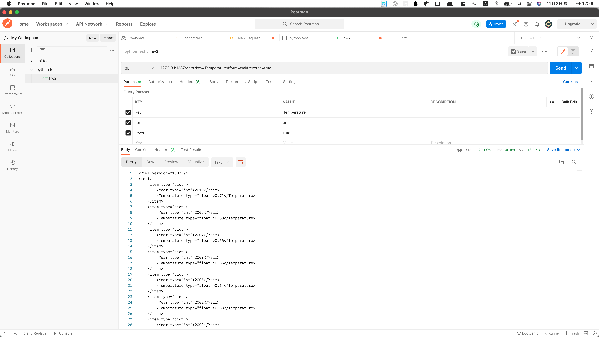
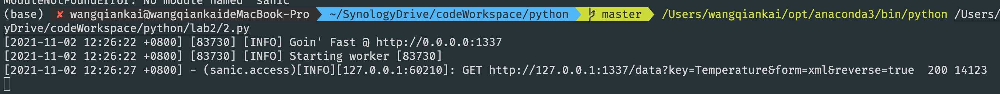

# Python程序设计#2作业

班级：2019211308

学号：2019211504

姓名：王乾凱

## 作业题目

数据文件（test.txt）是一个全球温度年度异常历史数据。基于Sanic实现一个查询服务，服务包括：

* 按起始和结束年份查询历史数据，查询结果支持多种格式：JSON、XML、CSV（用逗号作为间隔符）。
* 按温度高低进行排序，支持升序和降序两种排序方式。

## 作业内容

程序源代码嵌入下方的code block中。

```python
from sanic import Sanic 
from sanic.response import json
from sanic.response import text
from sanic.response import file
from sanic import request
import csv
from dicttoxml import dicttoxml
from xml.dom.minidom import parseString


app = Sanic("Myapp")
data = []

def Dao():
    with open("test.txt", "r") as f:
        line = f.readline()
        while line:
            if line[0] == '#':
                line = f.readline()
                continue
            items = line.strip().split()
            dic_items = {'Year': int(items[0]), 'Temperature': float(items[1])}
            data.append(dic_items)
            line = f.readline()
    pass

@app.get('/data')
def handler(request):
    # return text('hello world')
    key = request.args.get('key', 'Year')
    form = request.args.get('form', 'json')
    sub_data = []
    if request.args.get('reverse') == 'true':
        sub_data = sorted(data[int(request.args.get('beginYear', 1880)) - 1880: int(request.args.get('endYear', 2010)) - 1880],\
                    key=lambda x:x[key], reverse=True)
    else:
        sub_data = sorted(data[int(request.args.get('beginYear', 1880)) - 1880: int(request.args.get('endYear', 2010)) - 1880],\
                    key=lambda x:x[key])
    
    if form == 'json':
        return json(sub_data)
    elif form == 'xml':
        return text(parseString(dicttoxml(sub_data).decode('utf-8')).toprettyxml(indent='\t'))
    elif form == 'csv':
        fileName = 'data_csv.csv'
        fieldnames=sub_data[0].keys() 
        with open(fileName,"wb") as csv_file:
            writer=csv.writer(csv_file)
            writer.writerow(fieldnames)
            for dict in sub_data:
                writer.writerow(dict.values())
        return file(fileName)
    return text("parse failed")

def test_dao(beginYear: int, endYear: int):
    sub_data = sorted(data[beginYear - 1880: endYear - 1880], key=lambda x:x['Lowess'], reverse=True) 
    print(sub_data.__str__())


if __name__ == '__main__':
    Dao()
    app.run(host='0.0.0.0', port=1337)
    # test_dao(2001, 2005)
```

## 代码说明

web应用设置的host是0.0.0.0，监视端口是1337，路由为“/data”，若无路由参数，则按年份正序排序， 从1880年到2010年的数据，默认返回数据类型为json。

参数参考：
url?{beginYear=(beginYear:int(1880~2020))}&{endYear:int(1880-2020)}&{form=(form:str('json'/'xml'/'csv'))}&{reverse=('true'/'false')}&{key:str}

## 运行截图



