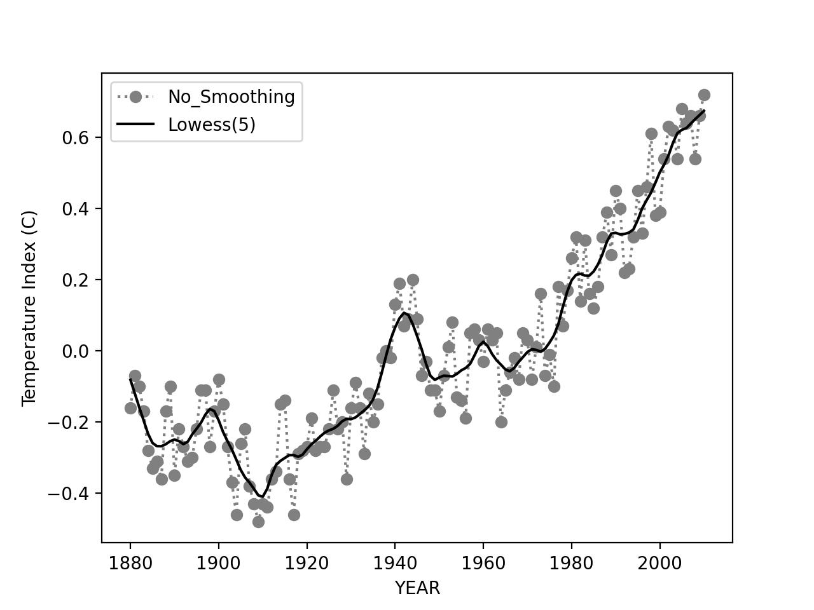

# Python程序设计#5作业

班级：2019211308

学号：2019211504

姓名：王乾凱

## 作业题目

基于#3作业、#4作业获取的No_Smoothing、Lowess数据项，在同一个图上分别绘制出折线图（No_Smoothing）和平滑线图（Lowess）。绘制结果对照参考图片（test.png）。

## 作业内容

程序源代码嵌入下方的code block中。

```python
import asyncio
import json

import aiohttp
import matplotlib.pyplot as plt
import numpy as np
import statsmodels.api as sm

async def getGraph(x:np.ndarray, y:np.ndarray):
    # plt.scatter(x, y)
    plt.plot(x, y)
    pass


async def process(X:np.ndarray, Y:np.ndarray):
    lowess = sm.nonparametric.lowess
    n = np.size(X, 0);
    y_hat = lowess(Y, X, frac=10./n)[:, 1]
    
    return y_hat.tolist()
    
    
async def main(params):
    async with aiohttp.ClientSession('http://127.0.0.1:1337') as session:
        async with session.get('/data', params = params) as response:
            form = params.get('form', 'json')
            if form == 'json':
                json_str = await response.json()
                # j_data = json.loads(json_str)
                x = []
                y = []
                for data in json_str:
                   x.append(data.get('Year')) 
                   y.append(data.get('Temperature'))
                str = json.dumps(json_str, indent=4, sort_keys=True)
                
                z = await process(np.array(x), np.array(y))
                for a, b, c in zip(x, y, z):
                    print(a, b, round(c, 2))
                await getGraph(x, y)
                await getGraph(x, z)
                plt.savefig('./test.jpg', dpi=200)

            else:
                print(await response.text())
            


def test():
    key = input('input keyword (Temparature/[Year]):')
    if key == '':
        key = 'Year'
    reverse = input('want reverse sort \? (y/[N]):')
    if reverse == 'y':
        reverse = 'True'
    form = input('form \? (csv/xml/[json]):')
    if form == '':
        form = 'json'
    params = {'key': key, 'reverse': reverse, 'form': form}
    return params


loop = asyncio.get_event_loop()
loop.run_until_complete(main(test()))

```

## 代码说明

